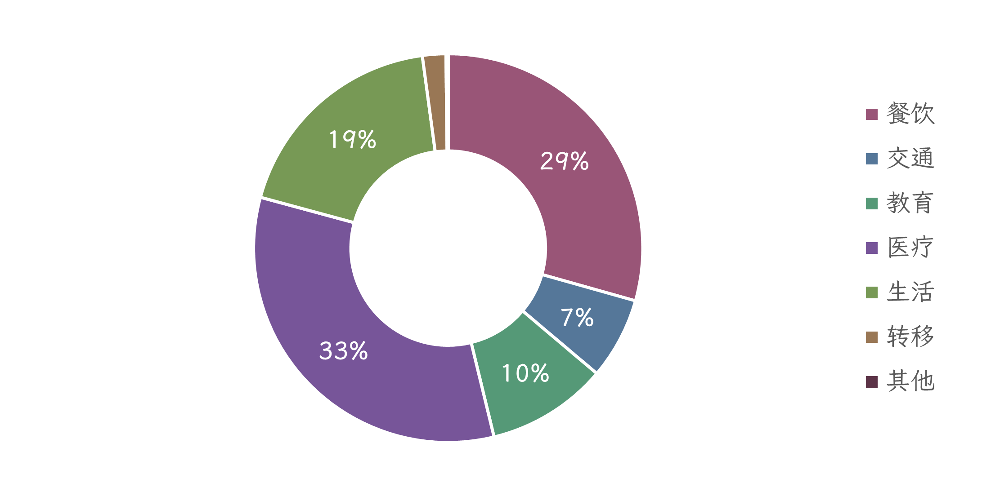
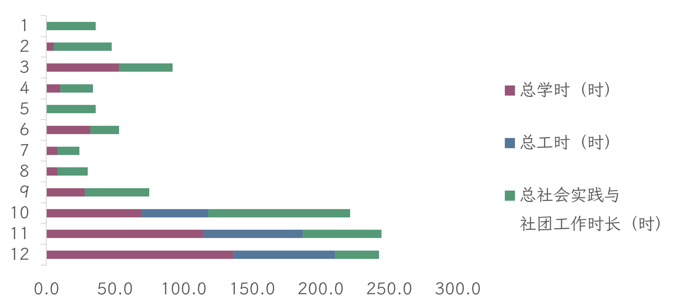
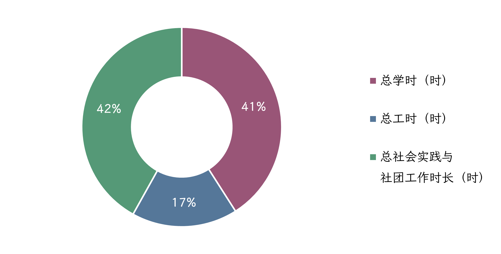

## 第一部分 经济

> 部分数据已删除或脱敏处理。

2024年，林雨夜全年实现收入 ###### 元，支出 ###### 元，结余 ###### 元，结余占收入的比重为19.4%；支出当中餐饮支出为 ###### 元，恩格尔系数为29.4%。

**
图1-1 支出分类占比情况
**

2024年，林雨夜全年实现资产增值 ###### 元，资产增长率为38.4%；其中流动资产增值 ###### 元。

## 第二部分 学业与就业

2024年，林雨夜共完成学业与就业时长1135.8时，其中学时463.3时，主要集中于3月和9~12月；工时194.5时，主要集中于10~12月；社会实践与社团工作时长476.0时，大致在各月份均匀分布，最大值出现于10月。具体情况如下表2-1至2-4、图2-1至2-2所示。

**
表2-1 学时统计（按月）
**

| 月份  | 课程学时（时） | 课业项目（时） | 科研项目（时） | 总计  |
| --- | --- | --- | --- | --- |
| 1   | 0\.0 | 0\.0 | 0\.0 | 0\.0 |
| 2   | 2\.5 | 1\.0 | 2\.0 | 5\.5 |
| 3   | 10\.0 | 16\.0 | 27\.0 | 53\.0 |
| 4   | 0\.0 | 4\.0 | 6\.0 | 10\.0 |
| 5   | 0\.0 | 0\.0 | 0\.0 | 0\.0 |
| 6   | 0\.0 | 24\.0 | 8\.0 | 32\.0 |
| 7   | 0\.0 | 8\.0 | 0\.0 | 8\.0 |
| 8   | 0\.0 | 8\.0 | 0\.0 | 8\.0 |
| 9   | 14\.0 | 14\.0 | 0\.0 | 28\.0 |
| 10  | 43\.0 | 21\.5 | 5\.0 | 69\.5 |
| 11  | 48\.0 | 38\.3 | 28\.5 | 114\.8 |
| 12  | 35\.5 | 86\.0 | 15\.0 | 136\.5 |
| 总计  | 153\.0 | 218\.8 | 91\.5 | 463\.3 |

> 数据来源：个人记录、Pingcode项目管理平台。

**
表2-2 工时统计（按月）
**

| 月份  | 全职工时（时） | 非全职工时（时） | 总计  |
| --- | --- | --- | --- |
| 1   | 0\.0 | 0\.0 | 0\.0 |
| 2   | 0\.0 | 0\.0 | 0\.0 |
| 3   | 0\.0 | 0\.0 | 0\.0 |
| 4   | 0\.0 | 0\.0 | 0\.0 |
| 5   | 0\.0 | 0\.0 | 0\.0 |
| 6   | 0\.0 | 0\.0 | 0\.0 |
| 7   | 0\.0 | 0\.0 | 0\.0 |
| 8   | 0\.0 | 0\.0 | 0\.0 |
| 9   | 0\.0 | 0\.0 | 0\.0 |
| 10  | 48\.5 | 0\.0 | 48\.5 |
| 11  | 65\.0 | 7\.0 | 72\.0 |
| 12  | 72\.0 | 2\.0 | 74\.0 |
| 总计  | 185\.5 | 9\.0 | 194\.5 |

> 数据来源：个人记录、Pingcode项目管理平台。

**
表2-3 社会实践与社团工作时长统计（按月）
**

| 月份  | 社会实践（时） | 社团工作（时） | 总计  |
| --- | --- | --- | --- |
| 1   | 0\.0 | 36\.0 | 36\.0 |
| 2   | 0\.0 | 42\.0 | 42\.0 |
| 3   | 0\.0 | 39\.0 | 39\.0 |
| 4   | 0\.0 | 24\.0 | 24\.0 |
| 5   | 0\.0 | 36\.0 | 36\.0 |
| 6   | 9\.0 | 12\.0 | 21\.0 |
| 7   | 8\.0 | 8\.0 | 16\.0 |
| 8   | 18\.0 | 4\.0 | 22\.0 |
| 9   | 21\.0 | 26\.0 | 47\.0 |
| 10  | 41\.0 | 62\.5 | 103\.5 |
| 11  | 31\.0 | 26\.5 | 57\.5 |
| 12  | 0\.0 | 32\.0 | 32\.0 |
| 总计  | 128\.0 | 348\.0 | 476\.0 |

> 数据来源：个人记录、Pingcode项目管理平台。

**
表2-4 学业与就业情况汇总（按月）
**

| 月份  | 总学时（时） | 总工时（时） | 
总社会实践与

社团工作时长（时）
 | 总计  |
| --- | --- | --- | --- | --- |
| 1   | 0\.0 | 0\.0 | 36\.0 | 36\.0 |
| 2   | 5\.5 | 0\.0 | 42\.0 | 47\.5 |
| 3   | 53\.0 | 0\.0 | 39\.0 | 92\.0 |
| 4   | 10\.0 | 0\.0 | 24\.0 | 34\.0 |
| 5   | 0\.0 | 0\.0 | 36\.0 | 36\.0 |
| 6   | 32\.0 | 0\.0 | 21\.0 | 53\.0 |
| 7   | 8\.0 | 0\.0 | 16\.0 | 24\.0 |
| 8   | 8\.0 | 0\.0 | 22\.0 | 30\.0 |
| 9   | 28\.0 | 0\.0 | 47\.0 | 75\.0 |
| 10  | 69\.5 | 48\.5 | 103\.5 | 221\.5 |
| 11  | 114\.8 | 72\.0 | 57\.5 | 244\.3 |
| 12  | 136\.5 | 74\.0 | 32\.0 | 242\.5 |
| 总计  | 465\.3 | 194\.5 | 476\.0 | 1135\.8 |

> 数据来源：个人记录、Pingcode项目管理平台。

**
图2-1 学业与就业时长（按月）
**

**
图2-2 各类别学业与就业时长占比
**
